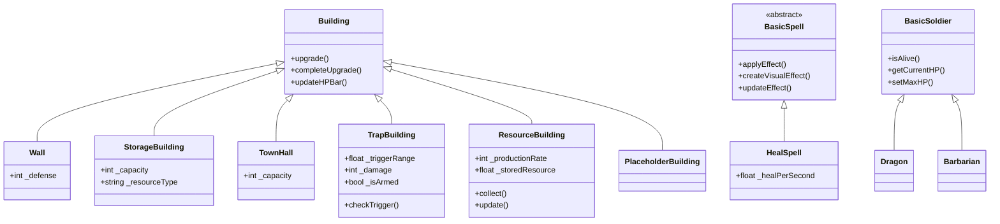

# 部落攻防（Clash-like）项目设计与实现文档

## 1. 项目概述

本项目为一款仿《部落冲突》的策略类游戏原型，客户端采用$C++$和$cocos2d$引擎，后端采用$flask$框架，进行开发，实现主村庄建设与进攻战斗两大核心玩法。玩家通过建设与升级建筑、训练兵种，在不同地图中发起进攻，由 AI 自动完成战斗过程，并根据战果获得资源与评价。

---

## 2. 需求覆盖说明

### 2.1 基础功能（全部实现）

* [X] 大本营系统
* [X] 三种资源：金币、圣水和人口
* [X] 建筑系统：资源生成建筑、军营、防御塔和存储建筑
* [X] 兵种系统：野蛮人、弓箭手、巨人、炸弹人和飞龙
* [X] AI 自动战斗：路径寻找、攻击判定、建筑优先级和建筑等级系统
* [X] 单局战斗流程：投放兵种、兵种自动战斗和胜负判定
* [X] 多张地图：地图编辑器支持设计并保存地图
* [X] 背景音乐与战斗音效

### 2.2 可选功能（全部实现）
* [X]  多人进攻：两次进攻机会，前人进攻结果保留
* [X]  联盟系统：成员加入、离开部落，首领创建、解散部落
* [X]  空中兵种：飞龙兵种无视城墙
* [X]  陷阱系统：炸弹陷阱，敌人靠近触发
* [X]  战斗回放：回放进攻过程
* [X]  建筑升级加速：加速建筑的升级过程
### 2.3 自行扩展
* [X] 后端云服务：$flask$框架，服务联机需求
### 2.4 加分项
#### 2.4.1 版本控制与协作
* [X] GitHub 使用规范
- 多$branch$同步推进解耦需求
- $master$采用$squash\space merge$，确保$commit$记录清晰
- 使用$code\space diff$进行$code\space review$
- 使用$issues$汇总开发时遇到的$Bug$并解决
- $gitignore$避免上传$build$中间文件
- $GitHub$ [仓库](https://github.com/daisun643/COC)
* [X] 合理分工
- 需求逻辑解耦
- 共同开发项目基座 
- 根据兴趣特长分配需求
- 一次分配一周工作量，一周一迭代
* [X] Commit 记录清晰
- $message$记录$commit$中功能添加、$Bug$修复等等
#### 2.4.2 代码质量
* [X] 单元测试
- 工具函数
  使用$Google\space Test$框架为工具函数编写单元测试，参见`Classes\test`。
- 图形界面
  编译后手动点击测试
* [X] 合理异常处理
  TODO
* [X] 无内存泄漏
- 单实例模式，避免反复$new$和$delete$
    ```cpp
    Profile* profile =  Profile::getInstance();
    ```
- 析构安全
    $BasicSence$作为$Scene$的基类，其维护不少配置类，为了防止子类错误析构，进而导致重复析构，类似下面在基类中采用$if$判断避免重复析构。
    ```cpp
    BasicSence::~BasicSence(){
      ...
      if(_buildingManager){
        delete _buildingManager;
      }
      ...
    }
    ```
#### 2.4.3 开发特性
* [X] C++11/14/17 特性使用丰富
  auto、lambda、function等等参见3.1
* [X] 优雅的架构设计
- 类的继承和多态运用
  参见 3.1
- 资源管理逻辑解耦
  $Classes/Manager$处理资源加载更新保存逻辑，与$Classes/Game$下游戏逻辑解耦。
- 规避配置硬编码
  配置$Resource$下$json$文件，通过$Classes/Manager$下$Manager$加载更新保存参数配置。
* [X] 目录结构清晰
  ```
  COC/
  ├── CMakeLists.txt        # CMake 主配置文件
  ├── build.bat             # Windows 构建脚本
  ├── .gitignore            # Git 忽略文件配置
  ├── README.md             # 项目说明文档
  ├── Classes/              # 源代码目录
  │   ├── Container/        # 场景容器
  │   │   ├── Layer/        # Layer容器
  │   │   ├── Node/         # Node容器
  │   │   └── Scene/        # Scene容器
  │   ├── Game/             # 游戏逻辑
  │   │   ├── Building/     # 建筑逻辑
  │   │   ├── Soldier/      # 士兵逻辑
  │   │   └── Spell/        # 法术逻辑
  │   ├── Manager/          # 运行时资源管理
  │   │   ├── Building/     # 建筑管理
  │   │   ├── Config/       # 参数管理
  │   │   └── Record/       # 回放管理
  │   ├── Utils/            # 工具函数
  │   │   ├── API/          # 网络请求
  │   │   └── Profile/      # 信息维护
  │   ├── AppDelegate.cpp   # 应用程序委托类
  │   └── main.cpp          # 程序入口
  │── Resources/            # 资源文件目录
  │   ├── config/           # 字体文件
  │   ├── develop/          # 字体文件
  │   ├── fonts/            # 字体文件
  │   ├── images/           # 图片资源
  │   ├── level/            # 字体文件
  │   ├── profile/          # 字体文件
  │   └── record/           # 音频资源
  ├── test/                 # 单元测试
  └── server/               # 服务器逻辑

  ```
#### 2.4.4 界面与体验
* [X] 界面精美
* [X] 游戏不卡顿不崩溃
* [X] 流畅动画
### 2.5 超级加分项
* [X] 成功运行于`Andriod`
  通过`Andriod Studio`进行代码和资源的打包。
---
##  3.项目要求覆盖说明
### 3.1 必须符合的要求(C++ 特性使用)
* [X] STL 容器:$vector、map 、set、pair、pair$
* [X] 迭代器
  TODO
这里不知道有没有
* [X] 类与多态

* [X] 异常处理
  TODO
* [X] 函数重载&操作符重载
  TODO
* [X] C++11 或以上功能
- lambda&auto
```cpp
auto loadFromPath = [this](const std::string& path) -> bool {
    ...
    return false;
  };
```
- nullptr
```cpp
struct PathNode {
  ...
  PathNode(...) : ..., parent(nullptr) {}
  ...
};
```
- range-for
```cpp
for (PathNode* node : allNodes) {
    delete node;
  }
```
- unordered_set
```cpp
  std::unordered_set<long long> validEndPoints;
  if (...) {
    validEndPoints.insert(coordToLong(eRow, eCol));
  } else {...}
```
- function
```cpp
static std::vector<Vec2> findPath(
      ...,const std::function<bool(int, int)>& isWalkable, ...);
```
### 3.2 项目必达标准
* [X] 代码格式统一
- $Google formater$统一代码风格
* [X] Google C++ Style
- 类名采用$PascalCase$命名法
- 成员变量采用下划线+$camelCase$命名法
- 函数名采用$camelCase$命名法
* [X] C++ 风格类型转换
- static_cast
```cpp
EventMouse* mouseEvent = static_cast<EventMouse*>(event);
```
- dynamic_cast
```cpp
DefenseBuilding* defenseBuilding = dynamic_cast<DefenseBuilding*>(building);
if (!defenseBuilding) {
  continue;
}
```
* [X] 合理使用 const
- 成员函数
```cpp
bool getIsLogin() const;
int getId() const; 
const std::string& getName() const;
```
- 参数传递
```cpp
void setName(const std::string& name); 
static void leaveClan(const std::string& clan_id, int user_id, JoinClanCallback callback);
```
* [X] 注释规范,设计说明明确
- 服务器逻辑中
```
"""
    获取随机对手接口
    GET 参数: user_id (用户ID)
    返回: JSON 格式 {
        "success": bool,
        "message": str,
        "opponent_id": int or None,
        "opponent_name": str or None,
        "map_data": dict or None
    }
"""
```
