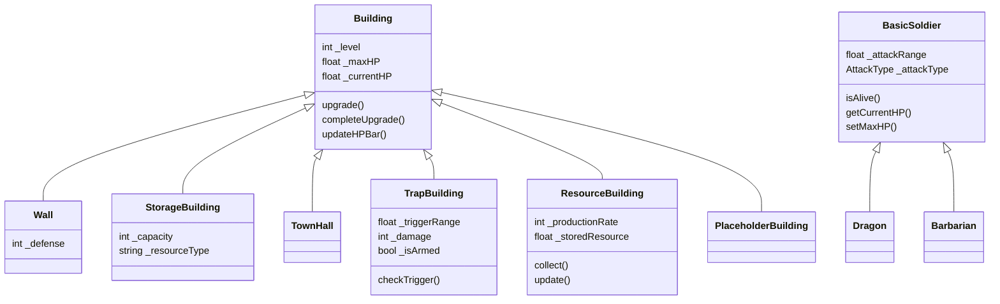

# 部落攻防（Clash-like）项目设计与实现文档

## 1. 项目概述

本项目为一款仿《部落冲突》的策略类游戏原型，客户端采用`C++`和`cocos2d`引擎，后端采用`flask`框架，进行开发，实现主村庄建设与进攻战斗两大核心玩法。玩家通过建设与升级建筑、训练兵种，在不同地图中发起进攻，由 AI 自动完成战斗过程，并根据战果获得资源与评价。

---

## 2. 需求覆盖说明

### 2.1 基础功能（全部实现）

* [X] 大本营系统
* [X] 三种资源：金币、圣水和人口
* [X] 建筑系统：资源生成建筑、军营、防御塔和存储建筑
* [X] 兵种系统：野蛮人、弓箭手、巨人、炸弹人和飞龙
* [X] AI 自动战斗：路径寻找、攻击判定、建筑优先级和建筑等级系统
* [X] 单局战斗流程：投放兵种、兵种自动战斗和胜负判定
* [X] 多张地图：地图编辑器支持设计并保存地图
* [X] 背景音乐与战斗音效

### 2.2 可选功能（全部实现）
* [X]  多人进攻：两次进攻机会，前人进攻结果保留
* [X]  联盟系统：成员加入、离开部落，首领创建、解散部落
* [X]  空中兵种：飞龙兵种无视城墙
* [X]  陷阱系统：炸弹陷阱，敌人靠近触发
* [X]  战斗回放：回放进攻过程
* [X]  建筑升级加速：加速建筑的升级过程
### 2.3 自行扩展
* [X] 后端云服务：`flask`框架，服务联机需求
### 2.4 加分项
#### 2.4.1 版本控制与协作
* [X] GitHub 使用规范
- 多`branch`同步推进解耦需求
- `master`采用`squash\space merge`，确保`commit`记录清晰
- 使用`code\space diff`进行`code\space review`
- 使用`issues`汇总开发时遇到的`Bug`并解决
- `gitignore`避免上传`build`中间文件
- `GitHub` [仓库](https://github.com/daisun643/COC)
* [X] 合理分工
- 需求逻辑解耦
- 共同开发项目基座 
- 根据兴趣特长分配需求
- 一次分配一周工作量，一周一迭代
* [X] Commit 记录清晰
- `message`记录`commit`中功能添加、`Bug`修复等等
#### 2.4.2 代码质量
* [X] 单元测试
- 工具函数
  使用`Google\space Test`框架为工具函数编写单元测试，参见`Classes\test`。
- 图形界面
  编译后手动点击测试
* [X] 合理异常处理
  当事件与预期不符合，通过`CCLOG`写入输出，再通过`VS`查看输出锁定异常。
```cpp
try {
  outFile << buffer.GetString();
  outFile.close();
  CCLOG("BuildingManager: Map saved to %s", path.c_str());
} catch (const std::exception& e) {
  CCLOG("BuildingManager: Error saving map to %s: %s", path.c_str(),
        e.what());
}
```
* [X] 无内存泄漏
- 单实例模式，避免反复`new`和`delete`
    ```cpp
    Profile* profile =  Profile::getInstance();
    ```
- 析构安全
    `BasicSence`作为`Scene`的基类，其维护不少配置类，为了防止子类错误析构，进而导致重复析构，类似下面在基类中采用`if`判断避免重复析构。
    ```cpp
    BasicSence::~BasicSence(){
      ...
      if(_buildingManager){
        delete _buildingManager;
      }
      ...
    }
    ```
#### 2.4.3 开发特性
* [X] C++11/14/17 特性使用丰富
  auto、lambda、function等等参见3.1
* [X] 优雅的架构设计
- 类的继承和多态运用
  参见 3.1
- 资源管理逻辑解耦
  `Classes/Manager`处理资源加载更新保存逻辑，与`Classes/Game`下游戏逻辑解耦。
- 规避配置硬编码
  配置`Resource`下`json`文件，通过`Classes/Manager`下`Manager`加载更新保存参数配置。
* [X] 目录结构清晰
  ```
  COC/
  ├── CMakeLists.txt        # CMake 主配置文件
  ├── build.bat             # Windows 构建脚本
  ├── .gitignore            # Git 忽略文件配置
  ├── README.md             # 项目说明文档
  ├── Classes/              # 源代码目录
  │   ├── Container/        # 场景容器
  │   │   ├── Layer/        # Layer容器
  │   │   ├── Node/         # Node容器
  │   │   └── Scene/        # Scene容器
  │   ├── Game/             # 游戏逻辑
  │   │   ├── Building/     # 建筑逻辑
  │   │   ├── Soldier/      # 士兵逻辑
  │   │   └── Spell/        # 法术逻辑
  │   ├── Manager/          # 运行时资源管理
  │   │   ├── Building/     # 建筑管理
  │   │   ├── Config/       # 参数管理
  │   │   └── Record/       # 回放管理
  │   ├── Utils/            # 工具函数
  │   │   ├── API/          # 网络请求
  │   │   └── Profile/      # 信息维护
  │   ├── AppDelegate.cpp   # 应用程序委托类
  │   └── main.cpp          # 程序入口
  │── Resources/            # 资源文件目录
  │   ├── config/           # 字体文件
  │   ├── develop/          # 字体文件
  │   ├── fonts/            # 字体文件
  │   ├── images/           # 图片资源
  │   ├── level/            # 字体文件
  │   ├── profile/          # 字体文件
  │   └── record/           # 音频资源
  ├── test/                 # 单元测试
  └── server/               # 服务器逻辑
  
  ```
#### 2.4.4 界面与体验
* [X] 界面精美
  使用网络素材包美化界面。
  
### 2.5 超级加分项
* [X] 成功运行于`Andriod`
  通过`Andriod Studio`进行代码和资源的打包，apk位于`release`中。
  
---
##  3.项目要求覆盖说明
### 3.1 必须符合的要求(C++ 特性使用)
* [X] STL 容器:`vector、map 、set、pair、pair`
* [X] 迭代器
  这里采用逆向迭代器，遍历建筑。
```cpp
for (auto it = _buildings.rbegin(); it != _buildings.rend(); ++it) {
  ...
}
```
* [X] 类与多态

* [X] 异常处理
  当事件与预期不符合，通过`CCLOG`写入输出，再通过`VS`查看输出锁定异常。
```cpp
try {
  outFile << buffer.GetString();
  outFile.close();
  CCLOG("BuildingManager: Map saved to %s", path.c_str());
} catch (const std::exception& e) {
  CCLOG("BuildingManager: Error saving map to %s: %s", path.c_str(),
        e.what());
}
```
* [X] 函数重载&操作符重载
  重载`-=`运算符，实现对建筑生命值的减少。
```cpp
Building& Building::operator-=(float damage) {
  ...
  _currentHP -= damage;
  if (_currentHP < 0) {
    _currentHP = 0;
  }
  ...
  return *this;
}
```
* [X] C++11 或以上功能
- lambda&auto
```cpp
auto loadFromPath = [this](const std::string& path) -> bool {
    ...
    return false;
  };
```
- nullptr
```cpp
struct PathNode {
  ...
  PathNode(...) : ..., parent(nullptr) {}
  ...
};
```
- range-for
```cpp
for (PathNode* node : allNodes) {
    delete node;
  }
```
- unordered_set
```cpp
  std::unordered_set<long long> validEndPoints;
  if (...) {
    validEndPoints.insert(coordToLong(eRow, eCol));
  } else {...}
```
- function
```cpp
static std::vector<Vec2> findPath(
      ...,const std::function<bool(int, int)>& isWalkable, ...);
```
### 3.2 项目必达标准
* [X] 代码格式统一
- `Google formater`统一代码风格
* [X] Google C++ Style
- 类名采用`PascalCase`命名法
- 成员变量采用下划线+`camelCase`命名法
- 函数名采用`camelCase`命名法
* [X] C++ 风格类型转换
- static_cast
```cpp
EventMouse* mouseEvent = static_cast<EventMouse*>(event);
```
- dynamic_cast
```cpp
DefenseBuilding* defenseBuilding = dynamic_cast<DefenseBuilding*>(building);
if (!defenseBuilding) {
  continue;
}
```
* [X] 合理使用 const
- 成员函数
```cpp
bool getIsLogin() const;
int getId() const; 
const std::string& getName() const;
```
- 参数传递
```cpp
void setName(const std::string& name); 
static void leaveClan(const std::string& clan_id, int user_id, JoinClanCallback callback);
```
* [X] 注释规范,设计说明明确
- 服务器逻辑中
```
"""
    获取随机对手接口
    GET 参数: user_id (用户ID)
    返回: JSON 格式 {
        "success": bool,
        "message": str,
        "opponent_id": int or None,
        "opponent_name": str or None,
        "map_data": dict or None
    }
"""
```
### 3.3 核心技术实现细节

#### 3.3.1 面向对象设计范式的实践

针对游戏中种类繁多的建筑与兵种，我们利用 C++ 的继承、多态与封装特性，构建了高内聚、低耦合的实体架构。

1. 继承体系与抽象

通过提取共性构建清晰的类层次，最大化代码复用。

- **建筑抽象体系**：
  - **基类封装**：`Building` 类作为所有建筑的根基，封装了核心属性（如 `_level` 等级、`_currentHP` 生命值、`_row/_col` 网格坐标）与通用行为接口（如 `takeDamage()` 受击、`isAlive()` 存活判定）。
  - **派生类特化**：
    - **`DefenseBuilding` (防御塔)**：继承自 `Building`，扩展了 **攻击行为**。新增 `_attackRange` (射程)、`_damage` (伤害) 属性，并实现了 `attackSoldiers()` 索敌逻辑。
    - **`ResourceBuilding` (资源设施)**：继承自 `Building`，扩展了 **生产行为**。新增 `_productionRate` 属性与 `harvest()` 接口，利用 `update()` 钩子实现资源的定时产出。
- 多态与运行时行为

利用虚函数机制实现“同一接口，不同行为”，提升系统的可扩展性。

- 差异化的升级逻辑：

  基类定义了 virtual void upgrade()。

  ```c++
  void DefenseBuilding::upgrade() {
    Building::upgrade(); // 复用基类逻辑（等级+1，纹理刷新）
    // 扩展派生类特有逻辑：数据驱动更新攻击属性
    auto config = ConfigManager::getInstance()->getBuildingConfig(_buildingName, _level);
    this->_damage = config.damage;
  }
  ```

  这种设计符合 **开闭原则 (OCP)**：若未来新增“陷阱”类建筑，只需继承基类并重写 `upgrade`，无需修改核心升级系统的代码。

**3. 设计模式的应用**

- 简单工厂模式：

  为解耦对象创建与使用，兵种生成模块采用工厂方法。UI 层只传入 SoldierType 枚举，工厂负责返回对应派生类实例，符合 依赖倒置原则：

  ```c++
  BasicSoldier* BasicSoldier::create(SoldierType soldierType, int level) {
    switch (soldierType) {
      case SoldierType::BARBARIAN: return Barbarian::create(level);
      case SoldierType::ARCHER:    return Archer::create(level);
      // ... 新增兵种只需在此添加 case，无需修改外部调用逻辑
    }
    return nullptr;
  }
  ```

- 单例模式：

  对于全局唯一的配置管理器 ConfigManager 和音频管理器 AudioManager，我们实现了线程安全的单例模式。通过私有化构造函数并提供静态访问点 getInstance()，确保了全局资源的一致性访问，避免了重复加载配置文件的 IO 开销。

- 有限状态机 (FSM)：

  在 BasicSoldier 的 AI 设计中，我们使用状态模式管理兵种行为。定义 SoldierState 枚举 (IDLE, MOVING, ATTACKING, DEAD)，在 update() 中根据状态切换行为逻辑，保证了复杂战斗逻辑下的状态流转清晰可控。

#### 3.3.2 智能算法与 AI 决策

1. 高精度 A 寻路算法优化*

为解决士兵寻路问题，PathFinder 类实现了一套优化的 A* 算法：

- **子网格精度细分**：引入 `precision`（默认 4），将一个逻辑网格细分为 16 个 (4x4) 寻路子网格。计算时使用高精度坐标，输出路径时通过 `(curr->row + 0.5f) / precision` 将坐标修正到子网格中心，实现了平滑的移动轨迹。
- **数据结构优化**：使用 `std::priority_queue` 管理开放列表，确保每次以 $O(1)$ 时间复杂度取出 F 值最小的节点。
- **启发式函数优化**：使用曼哈顿距离 (`std::abs(dx) + std::abs(dy)`) 作为启发函数 $H$，在网格地图中相比欧几里得距离计算开销更低且更符合移动规则。
- **策略模式应用**：`findPath` 接口接收 `std::function<bool(int,int)> isWalkable` 回调。普通兵种传入常规碰撞检测，而**炸弹人**传入特殊检测函数（将“墙体”视作可通行目标），从而复用了核心算法实现了完全不同的 AI 行为。
- 多级 AI 索敌决策树

为了还原真实的战斗策略，我们在 findTarget 中实现了一套三级优先级决策系统：

1. **首选目标**：根据兵种特性（如巨人优先攻击防御塔）筛选特定类型建筑。
2. **次选兜底：若首选目标不存在，自动降级搜索最近的任意非墙建筑。
3. **破墙机制：当 A* 寻路返回空路径（被围墙完全阻挡）时，AI 智能识别并锁定最近的城墙作为临时攻击目标。

#### 3.3.3 全异步网络通信与数据驱动架构

1. 异步非阻塞通信

为了避免网络交互阻塞主线程导致游戏卡顿，客户端采用了全异步设计：

- **Lambda 与闭包**：使用 C++11 Lambda 表达式封装 `HttpRequest` 回调，通过值捕获 `[callback]` 传递上下文，避免了传统函数指针导致的上下文丢失问题。

  ```c++
  request->setResponseCallback([callback](HttpClient* client, HttpResponse* response) {
    // 在回调中解析数据并通过 callback 回传，不阻塞主线程
    if (callback) callback(success, message, ...);
  });
  ```

- 数据驱动设计

游戏的核心数值（如兵种血量、建筑造价）并未硬编码在 C++ 代码中，而是完全分离至 JSON 配置文件。ConfigManager 利用 rapidjson 在运行时加载 config/building.json 等文件。这种设计使得数值策划可以在不重新编译程序的情况下调整游戏平衡性，极大地提高了开发效率。同时，在解析时通过 IsObject、IsString 等严格类型检查，提高了面对异常网络数据时的健壮性。